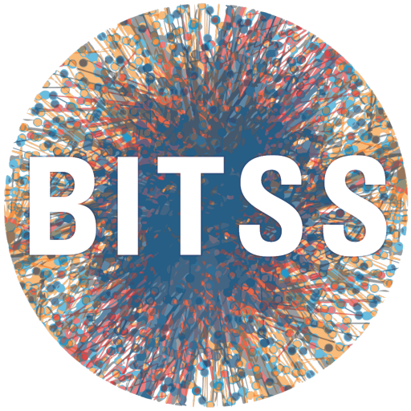

## Contributors

This site was authored by Florian Kohrt, Josephine Zerna, Christoph Scheffel,
Felix Schönbrodt, and Pat Callahan.

This tutorial was created by Florian Kohrt.
It is based on previous work by Josephine Zerna and Christoph Scheffel.
Comments on earlier versions were kindly provided by
Malika Ihle, Florian Pargent, Jonas Hagenberg, Felix Schönbrodt,
and Sarah von Grebmer zu Wolfsthurn.
Felix Schönbrodt created this short version of the [longer original tutorial](https://lmu-osc.github.io/code-publishing/).

## License and Disclaimer

None of the discussion in this tutorial constitutes legal advice.

Except where noted otherwise, the narrative text in this tutorial
is licensed under [CC\ BY-SA\ 4.0](LICENSE-CC-BY-SA.txt);
the code without any narrative text is also (at your option)
available under [CC0\ 1.0](LICENSE-CC0.txt).

The files `Manuscript.qmd` and `Bibliography.bib` are made available
by Josephine Zerna and Christoph Scheffel under [CC0\ 1.0](LICENSE-CC0.txt).

The screenshots of the [RStudio IDE](https://github.com/rstudio/rstudio)
are Copyright (C) 2024 Posit PBC and are available
under the [GNU Affero General Public License v3](LICENSE-AGPL.txt).
The source code is available on [GitHub](https://github.com/rstudio/rstudio/tree/v2024.04.2%2B764).

## Notes

This tutorial was primarily written in 2025 using [R](https://cloud.r-project.org/)
and [Quarto](https://quarto.org/docs/download/release.html).
Major changes to either can be found at the websites linked above,
for the most up-to-date information,
and to confirm that our tutorial is not out-of-date.

## Utilized Software

```{r}
#| echo: false

grateful::cite_packages(
  output = "paragraph",
  out.dir = ".",
  pkgs = unique(renv::dependencies(progress = FALSE)$Package),
  passive.voice = TRUE
) |>
  withr::with_options(new = list(warnPartialMatchDollar = FALSE))
```

Quarto  was utilized to render the files.

```{r}
#| class-output: "txt code-overflow-scroll"

sessioninfo::session_info()
```


This tutorial was written using the [`lmu-osc/tutorial-template`](https://github.com/lmu-osc/tutorial-template) Quarto extension [@callahan2026].

::: {#refs}
:::

## How to Cite

**To cite this tutorial, please refer to the project's [CITATION.cff](CITATION.cff) file or use the BibTeX citation provided in the appendix below.**

## Funding

::: {.column-margin}
{width=250px}
:::

This work was partly funded by the Berkeley Initiative
for Transparency in the Social Sciences (BITSS),
managed by the Center for Effective Global Action (CEGA).
